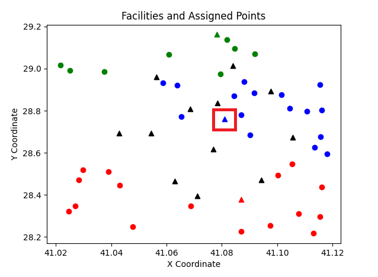
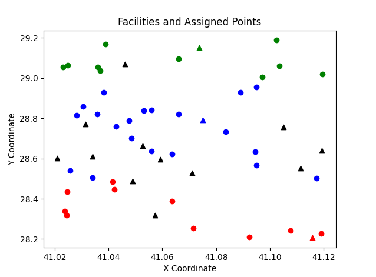

# Sonuçlar

Bu dosyada, K-Merkez Problemi için kullanılan açgözlü algoritmanın nasıl çalıştığını ve elde edilen sonuçları teknik olarak açıklayacağız.

## Algoritma Açıklaması

K-Merkez Problemi, belirli sayıda tesisin konumlandırılması ve her müşterinin en yakın tesise atanması ile ilgilidir. Amaç, en uzak müşteri-tesis mesafesini minimize etmektir. Bu problem, özellikle enerji dağıtım, lojistik ve servis ağları gibi alanlarda yaygın olarak karşılaşılan bir sorundur.

### Adım Adım Açgözlü K-Merkez Algoritması

1. **Başlangıç Adımı**: Tüm potansiyel tesis konumları ve bu konumların maliyetleri belirlenir. Potansiyel konumlar, müşteri talepleri ve lojistik avantajlar göz önünde bulundurularak seçilir.

2. **İlk Merkez Seçimi**: İlk adımda, en uzak müşteriye olan mesafeyi minimize eden ilk tesis konumu seçilir. Bu adım, müşterilere en yakın merkezi seçerek başlamayı sağlar.

3. **K Merkez Seçilene Kadar Tekrarlama**: Seçilen ilk merkezden sonra, aşağıdaki adımlar K tesis seçilene kadar tekrarlanır:
    - **Yeni Merkez Seçimi**: Mevcut tesislerin konumları sabit tutularak, kalan potansiyel tesisler arasından yeni bir merkez seçilir. Yeni merkezin seçimi, en uzak müşteriye olan mesafeyi minimize edecek şekilde yapılır.
    - **Müşteri Atamaları**: Her iterasyonda, tüm müşteriler mevcut açık tesisler arasında yeniden atanır. Her müşteri, en yakın tesise atanarak toplam mesafe minimize edilir.
    - **Performans Değerlendirmesi**: Yeni seçilen tesisin performansı değerlendirilir ve en uygun konum olup olmadığı kontrol edilir. Gerekiyorsa iyileştirmeler yapılır.

### Örnek Uygulama ve Sonuçlar

Bir örnek üzerinden algoritmanın nasıl çalıştığını inceleyelim:

#### Veri Hazırlığı

İstanbul'daki çeşitli semtlerdeki potansiyel şarj istasyonu yerleri ve elektrikli araç sahiplerinin konumları belirlenir. Müşterilerin konumları ve potansiyel tesislerin maliyetleri analiz edilir.

#### İlk Merkez Seçimi

İlk tesis, en uzak müşteriye olan mesafeyi minimize edecek şekilde seçilir. Örneğin, Kadıköy'de bulunan bir müşteriye en yakın tesis Üsküdar'da olabilir.

#### Yeni Merkez Seçimi ve Müşteri Atamaları

İkinci tesis, mevcut tesis (Üsküdar) sabit tutularak seçilir. Yeni tesis, örneğin Beşiktaş'ta olabilir. Tüm müşteriler, Üsküdar ve Beşiktaş tesisleri arasında en yakın olanına atanır.

#### Performans Değerlendirmesi ve Son İyileştirmeler

Üçüncü ve dördüncü tesisler de benzer şekilde seçilir ve tüm müşteriler en yakın tesise atanarak toplam mesafe minimize edilir. Sonuçta, İstanbul'un çeşitli semtlerinde seçilen K tesis, en uzak müşteri-tesis mesafesini minimize edecek şekilde konumlandırılmış olur.

### Sonuçların Değerlendirilmesi

Bu açgözlü algoritma, K-Merkez Problemi için hızlı ve etkili bir çözüm sunar. Algoritmanın performansı, belirli sayıda tesisin optimal konumlandırılmasını sağlayarak müşteri memnuniyetini artırır ve lojistik maliyetleri düşürür. EnerjiCo, bu algoritmayı kullanarak İstanbul'da en verimli şarj istasyonu yerlerini belirleyip kurmuş ve elektrikli araç sahiplerine daha iyi hizmet sunmuştur.

---

Bu teknik açıklama, EnerjiCo'nun İstanbul'da yeni şarj istasyonları kurma sürecinde kullandığı açgözlü K-Merkez algoritmasının nasıl çalıştığını ve elde edilen sonuçların değerlendirilmesini kapsamaktadır.
